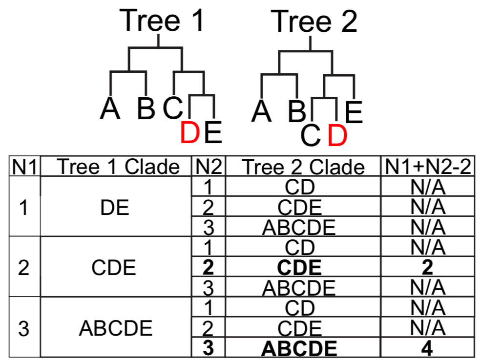

.. include:: /Includes.rst.txt

***************
Quick Start
***************

To get acquainted with UShER, we have provided a simple example of placing 10 samples on an existing phylogeny, and doing basic analyses to assess the placements. If you have not yet installed UShER, `please follow the instructions here <https://usher-wiki.readthedocs.io/en/latest/UShER.html#installation>`_ before continuing with this example.

------------------------
Files you will need
------------------------

* `pruned_10.nh <https://github.com/bpt26/usher_wiki/raw/main/docs/source/pruned_10.nh>`_ (newick file containing the initial phylogeny)
* `pruned_10.vcf.gz <https://github.com/bpt26/usher_wiki/raw/main/docs/source/pruned_10.vcf.gz>`_ (.vcf.gz file informing the initial phylogeny)
* `missing_10.vcf.gz <https://github.com/bpt26/usher_wiki/raw/main/docs/source/missing_10.vcf.gz>`_ (.vcf.gz file containing samples to be placed)
* `missing_10.txt <https://github.com/bpt26/usher_wiki/raw/main/docs/source/missing_10.txt>`_ (new-line separated list of samples to be placed)
* `full_tree.nh <https://github.com/bpt26/usher_wiki/raw/main/docs/source/full_tree.nh>`_ (newick file containing the full tree, to assess UShER's performance)

------------------------
Making the protobuf
------------------------

A major part of UShER's speed and memory-efficiency is its usage of .pb protobuf files to encode mutation annotated trees. To create the mutation annotated tree we'll need here, use the following command:

`usher --tree pruned_10.nh --vcf pruned_10.vcf.gz --collapse-tree --save-mutation-annotated-tree pruned_10.pb`

This command will read in both the newick file and the .vcf and output a .pb file storing all mutations as well as the structure of the tree.

------------------------
Placing samples
------------------------

Now, we want to place the samples from `missing_10.vcf.gz` onto our tree. We can do this by using the following command:

`usher --vcf MISSING_VCF/missing_10.vcf.gz --load-mutation-annotated-tree pruned_10.pb --write-uncondensed-final-tree`

This command will output three files:

* `final-tree.nh` (newick-formatted tree with identical samples condensed)
* `uncondensed-final-tree.nh` (newick-formatted tree containing all samples)
* `mutation-paths.txt` (tab-separated file containing each sample, the nodes leading to that sample in the final tree, and the mutations at those nodes)

------------------------
Assessing performance
------------------------

TreeCmp
---------------

To compare the final tree output by UShER to `full_tree.nh`, there are several options. We recommend downloading TreeCmp, which is `available to download here <https://github.com/TreeCmp/TreeCmp>`_. Upon installation, the following command:

`java -jar treeCmp.jar -r final-tree.nh -d rf -i full_tree.nh -o results.txt`

should show that the `Robinson-Foulds distance <https://en.wikipedia.org/wiki/Robinson%E2%80%93Foulds_metric>`_ between the two trees is 0.0, indicating that UShER placed each of the ten samples correctly.

find_sister_clades
---------------------------

We also described a method for measuring tree congruence involving comparing the sister clades at several generations, and finding the minimum combined number of generations at which a given sample has the same sister clades in two trees. For clarity, we provide the figure below:

To determine this statistic for our tree, the following commands will give our N1 results:

`find_sister_clades --generations 1 final-tree.nh --samples missing_10.txt > final_tree_n1.txt`

`find_sister_clades --generations 1 full_tree.nh --samples missing_10.txt > full_tree_n1.txt`

Then, upon comparing the clade sets for each sample, you would find that they are identical.

