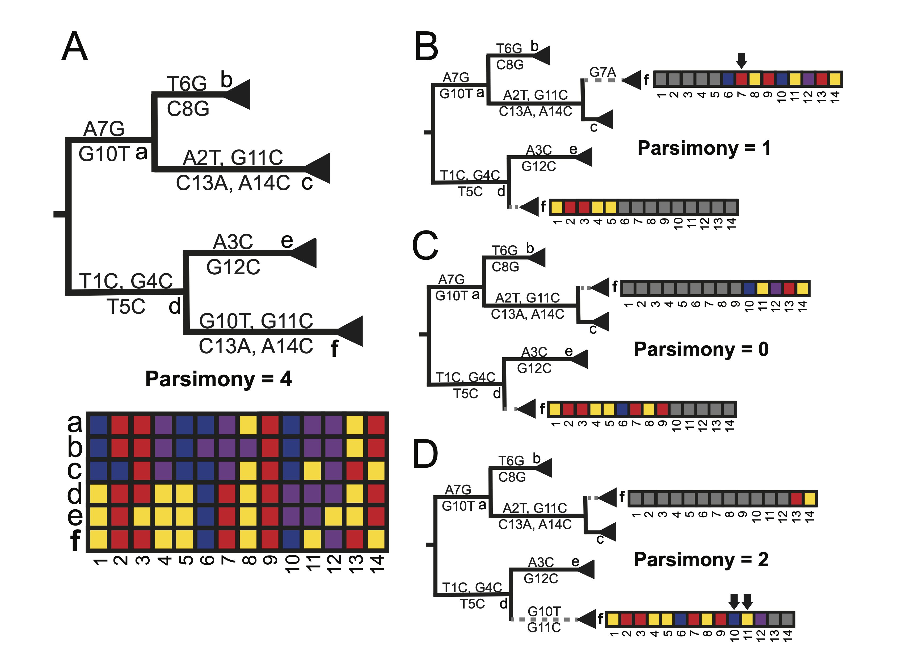

.. include:: includes.rst.txt

***************
RIPPLES
***************

RIPPLES (Recombination Inference using Phylogenetic PLacEmentS) is a program used to detect recombination events in large mutation annotated tree (MAT) files.

-------------
Installation
-------------

To install RIPPLES, simply follow the directions for `installing UShER <https://usher-wiki.readthedocs.io/en/latest/Installation.html>`_, and RIPPLES will be included in your installation.

--------------
Methodology
--------------

RIPPLES is a program thatto rapidly and sensitively detect recombinant nodes and their ancestors in a mutation-annotated tree (MAT). RIPPLES exploits the fact that recombinant lineages arising from diverse genomes will often be found on “long branches” which result from accommodating the divergent evolutionary histories of the two parental haplotypes. Therefore, RIPPLES first identifies long branches in a MAT. RIPPLES then exhaustively breaks the potential recombinant sequence into distinct segments that are differentiated by mutations on the recombinant sequence and separated by up to two breakpoints. For each set of breakpoints, RIPPLES places each of its corresponding segments using maximum parsimony to find the two parental nodes – a donor and an acceptor – that result in the highest parsimony score improvement relative to the original placement on the global phylogeny. The nodes for which a set of breakpoints along with two parental nodes can be identified that provide a parsimony score improvement above a user-specified threshold are reported as recombinants. The figure below illustrates the RIPPLES algorithm.

In the partial phylogeny shown above, node **f** is the result of a recombination event between nodes **c** and **d**. In order to detect this, RIPPLES searches possible donor and acceptor pairs at which to place **f** for the set of placements resulting in greatest parsimony improvement. In panel B, the breakpoint is assumed to be after position 5 in the genome. Upon partially placing **f** as a descendant of node **d** and as a sibling to node **c** using this breakpoint, the parsimony score is 1, as the terminal branch for node **f** as a sibling of **c** contains one mutation (G7A). In panel C, however, an optimal donor, acceptor, and breakpoint are found. With the breakpoint after position 9 in the genome, this placement of **f** results in a parsimony score of 0. Given that the initial parsimony score of **f** was 4 (panel A), this is an overall parsimony score improvement of 4, indicating that this is likely a true recombination event.

--------------
Options
--------------

.. code-block:: sh

  --input-mat (-i): Input mutation-annotated tree file [REQUIRED]. If only this argument is set, print the count of samples and nodes in the tree.
  --outdir (-d): Write all output files to the target directory. Default is current directory.
  --branch-length (-l): Minimum length of the branch to consider for recombination events. Default = 3.
  --min-coordinate-range (-r): Minimum range of the genomic coordinates of the mutations on the recombinant branch. Default = 1,000.
  --max-coordinate-range (-R): Maximum range of the genomic coordinates of the mutations on the recombinant branch. Default = 10,000,000. 
  --samples-filename (-s): Restrict the search to the ancestors of the samples specified in the input file. 
  --parsimony-improvement (-p): Minimum improvement in parsimony score of the recombinant sequences during the partial placement. Default = 3.
  --num-descendants (-n): Minimum number of leaves that node should have to be considered for recombinatino. Default = 10.
  --threads (-T): Number of threads to use when possible. Default = use all available cores.
  --help (-h): Print help messages.  

--------------
Usage
--------------

RIPPLES minimally requires an input MAT to search for recombination events. An example workflow is available  :ref:`here <ripples-tutorial>`.

--------------
Publications
--------------

- Turakhia Y, Thornlow B, Hinrichs A, McBroome J, Ayala N, Ye C, De Maio N, Haussler D, Lanfear R, and Corbett-Detig R. `Pandemic-Scale Phylogenomics Reveals Elevated Recombination Rates in the SARS-CoV-2 Spike Region., <https://www.biorxiv.org/content/10.1101/2021.08.04.455157v1.abstract>`_ *bioRxiv*. 2021.

