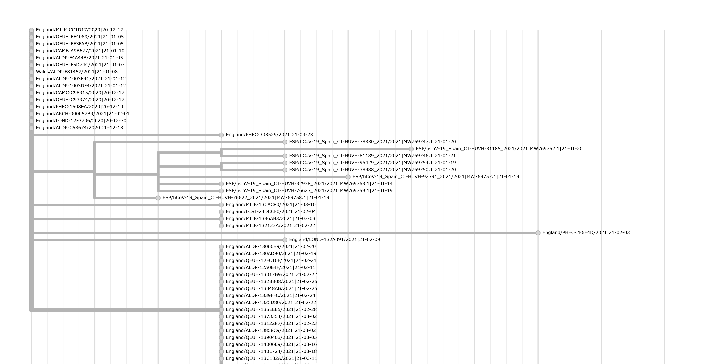

.. include:: includes.rst.txt

*********************************************
Tutorials
*********************************************

This document contains example workflows for Usher and matUtils.

.. _uncertainty-tutorial:

Example Uncertainty Workflow
----------

In this example we will calculate uncertainty metrics for samples belonging to clade A.2.4 and visualize them on `auspice <https://auspice.us/>`_.

Download the example protobuf file `public-2021-03-02.all.masked.nextclade.pangolin.pb <https://hgwdev.gi.ucsc.edu/~angie/UShER_SARS-CoV-2/2021/03/02/public-2021-03-02.all.masked.nextclade.pangolin.pb>`_ (protobuf file containing the mutation annotated tree with clade annotations)

The first step is generating a visualizable JSON of the clade of interest, along with getting the names of samples involved.
This is done with matUtils extract.

.. code-block:: shell-session

    matUtils extract -i public-2021-03-02.all.masked.nextclade.pangolin.pb -c A.2.4 -u a24_samples.txt -j a24_viz.json

The second step is to call matUtils uncertainty. The input PB is the original PB, with the sample selection text file, instead of a subtree pb generated with -o.
This is because its going to search for placements all along the original tree; if a subtree .pb was passed, it would only search for placements within that subtree.

.. code-block:: shell-session

    matUtils uncertainty -i public-2021-03-02.all.masked.nextclade.pangolin.pb -s a24_samples.txt -e a24_epps.tsv -n a24_ns.tsv

These can now be uploaded for visualization by drag and drop onto the `auspice <https://auspice.us/>`_ website. Drag and drop the a24_viz.json first, then a24_epps.tsv second.

.. _introduce-tutorial:

Example Introduce Workflow
----------

.. note:: 
    THIS FEATURE IS EXPERIMENTAL. We are actively soliciting feedback on the usefulness of the current implementation, additional features
    that would be valuable, or directions to take this type of analysis. Please reach out on the GitHub or directly to me via my email, 
    jmcbroom@ucsc.edu.

In this example we will infer and investigate introductions of SARS-CoV-2 into Spain using public information
on the command line and visualize an example introduction of interest with Auspice.

Before beginning, download the example protobuf file `public-2021-04-20.all.masked.nextclade.pangolin.pb <https://hgwdev.gi.ucsc.edu/~angie/UShER_SARS-CoV-2/2021/03/02/public-2021-04-20.all.masked.nextclade.pangolin.pb>`_ 

We need a region to analyze; in this example, we are going to use Spain, as it has a few hundred samples represented in the public data
and is a solid representative example. We need to generate the two-column tab-separated file we use as input to `matUtils introduce`.

.. code-block:: shell-session

    matUtils summary -i public-2021-04-20.all.masked.nextclade.pangolin.pb -s 420_sample_parsimony.txt
    grep “Spain” 420_sample_parsimony.txt | awk ‘{print $1”\tSpain”}’ > spanish_samples.txt

We can now apply `matUtils introduce` using this file as input.

.. code-block:: shell-session

    matUtils introduce -i public-2021-04-20.all.masked.nextclade.pangolin.pb -s spanish_samples.txt -o spanish_introductions.txt

The output table (spanish_introductions.txt) has columns for the sample, the identifier of the introduction node, the confidence of that introduction point being in region,
the confidence of the parent of that introduction point being in region, the number of mutations between the sample and this introduction point,
any clades associated with the introduction point, and the path of mutations to the point of introduction.

Generally the confidence of the introduction point will be greater than 0.5 and the confidence of the parent of the introduction point will be less than 0.5,
marking the point on the history where we stop being confident that the represented ancestral sequence was local to the region. 

We can count the number of unique introductions into our region of interest- in this case Spain- using awk.

.. code-block:: shell-session

    awk '{print $2}' spanish_introductions.tsv | sort | uniq -c | sort -r | head -25 

In this case, we see that many samples are unique single introductions (the point of introduction is the sample itself- the parent is probably not in region).
This may suggest that Spain has a lot of movement in and out of the country, or that sampling is biased towards travelers.

There are some interesting cases of clades from a single introduction, however. The clade introduced at the internal node "96055" 
contains 9 closely related samples from Spain and are all members of the variant of concern B.1.1.7.

.. code-block:: shell-session

    awk '$2 == "96055"' spanish_introductions.tsv

.. warning::
    Internal node names are not maintained in the protobuf and are not guaranteed to be consistent between protobufs with differing content.
    The path of mutations to the point of introduction will generally be consistent, however.

The first entry of this output is reproduced here.

ESP/hCoV-19_Spain_CT-HUVH-76622_2021/2021|MW769758.1|21-01-19	96055	1	0.0431655	2	20I/501Y.V1,B.1.1.7,B.1.1.28,20B,B.1.1,20A,B.1.1.171,B.1,19A,B	A2510G<C22208T<C28706T<A17615G<C27972T<G28048T<C14676T<C5388A<C3267T<T24506G<T16176C<C23271A<G24914C<A28281T<T6954C<C5986T<T28281A<C23604A,C23709T<T28048G<C913T<C28977T<G28048T<A28111G<C15279T<A23063T<G28280C,A28281T,T28282A<G28881A<G28882A,G28883C<C3037T<A23403G<C14408T<C241T<<

We can see that this introduction point is very confidently in Spain (confidence of 1 in column 3, as every descendent is from Spain) but that 
the parent of that introduction point is very confidently NOT from Spain (confidence of 0.043 to be in Spain). This makes this a strongly supported introduction
of a variant of concern into our region. Let's take a closer look by visualizing it on the `Auspice <https://auspice.us/>`_ web interface.

To do this, first we will need to generate an auspice-compatible JSON containing our introduction set and some context samples. We can do this 
by selecting one of our samples and extracting the context to a JSON with `matUtils extract`.

.. code-block:: shell-session

    matUtils extract -i public-2021-04-20.all.masked.nextclade.pangolin.pb -k "ESP/hCoV-19_Spain_CT-HUVH-76622_2021/2021|MW769758.1|21-01-19:50" -j spanish_introduction.json

This JSON can be drag-and-dropped onto the Auspice web inferface. The resulting image is reproduced here.

We can see from this image that our group of 9 B.1.1.7 samples forms a clear clade that was likely introduced into Spain from England.

Additional steps we could include are the generation of metadata tsv/csv for Auspice and the inclusion of phylogeographic statistics with
-a on our call to `matUtils introduce`. The latter increases the runtime of the introduce command from a few seconds to about two minutes in this case.

In the specific case of Spain, it has an overall association index of 10.4 with a 95% confidence interval of (28.95,40.19) for the null that 
samples from this region are not phylogenetically associated. This is normal for geographic regions, as naturally samples from the same region
are more closely related to one another. The largest monophyletic clade size is 9, representing our specific introduction of interest.

Our specific introduction of interest itself also has a monophyletic clade size of 9 (being pure with 9 samples) and an association index of 0,
representing that it is purely in-region and is maximally associated. 

.. _protobuf-tutorial:

Interacting with MAT Protobuf in Python [ADVANCED USERS]
----------

Advanced users may desire to interface directly with the protobuf. The following is a brief tutorial on doing so.
Google's general tutorial on interacting with protobuf in python can be found `here <https://developers.google.com/protocol-buffers/docs/pythontutorial#compiling-your-protocol-buffers>`_.
The instructions here can be applied to a number of additional languages supported by google as well, such as java, PHP, and ruby.

The first step is to call the protoc compiler to retrieve a MAT protobuf parser. Navigate to your Usher installation (or clone the github if you installed via conda) and call:

.. code-block:: shell-session

    protoc -I=./ --python_out=./ ./parsimony.proto

This will generate the python file "parsimony_pb2.py". 

You can import this file into your favorite python IDE and use it to access the MAT like so:

.. code-block:: python

    import parsimony_pb2
    pb_file = open('input.pb', 'rb')
    my_mat = parsimony_pb2.data()
    my_mat.ParseFromString(pb_file.read())
    pb_file.close()

The my_mat object now contains the protobuf information, with general protobuf class attributes and four MAT specific attributes.
These are newick, condensed_nodes, metadata, and node_mutations. 

The newick attribute is simply the newick string representing the tree, as stored in the protobuf.

.. code-block:: python

    print(my_mat.newick.count(":"))
    print(my_mat.newick[:100])

The metadata attribute is a list of metadata message objects, which each have a single attribute which is a list of strings.
These strings are the clade annotations for any given node. The mutation list is similar, being a list of lists. Each list contains a 
series of mutation messages, which have attributes describing their position and identity. Each list corresponds to a single node on the tree.

.. code-block:: python

    print(len(my_mat.metadata))
    print(len(my_mat.node_mutations))

Individual node mutations are encoded as integers instead of characters for efficiency. These are in ACGT order- that is, 0 is A, 1 is C, 2 is G, and 3 is T. 
Additionally, the mut_nuc (new mutation) is another list-like attribute.

.. code-block:: python

    convert = {i:s for i,s in enumerate("ACGT")}
    for t in my_mat.node_mutations:
        if len(t.mutation) > 0:
            first_mut = t.mutation[0]
            print("First mutation encountered identifier string is: {}".format(
                convert[first_mut.ref_nuc] +
                str(first_mut.position) +
                convert[first_mut.mut_nuc[0]]))
            break

Condensed nodes is a special format container that essentially acts as a list of objects. Each object has a node_name attribute 
which is the string naming that node and another container which is essentially a list of strings of sample names.

.. code-block:: python

    print(my_mat.condensed_nodes[0].node_name)
    print(len(my_mat.condensed_nodes[0].condensed_leaves))

These are the essentials for writing a custom analysis directly interacting with the protobuf. For most user's purposes, however,
matUtils should provide the tools necessary for interacting with a MAT .pb file.
