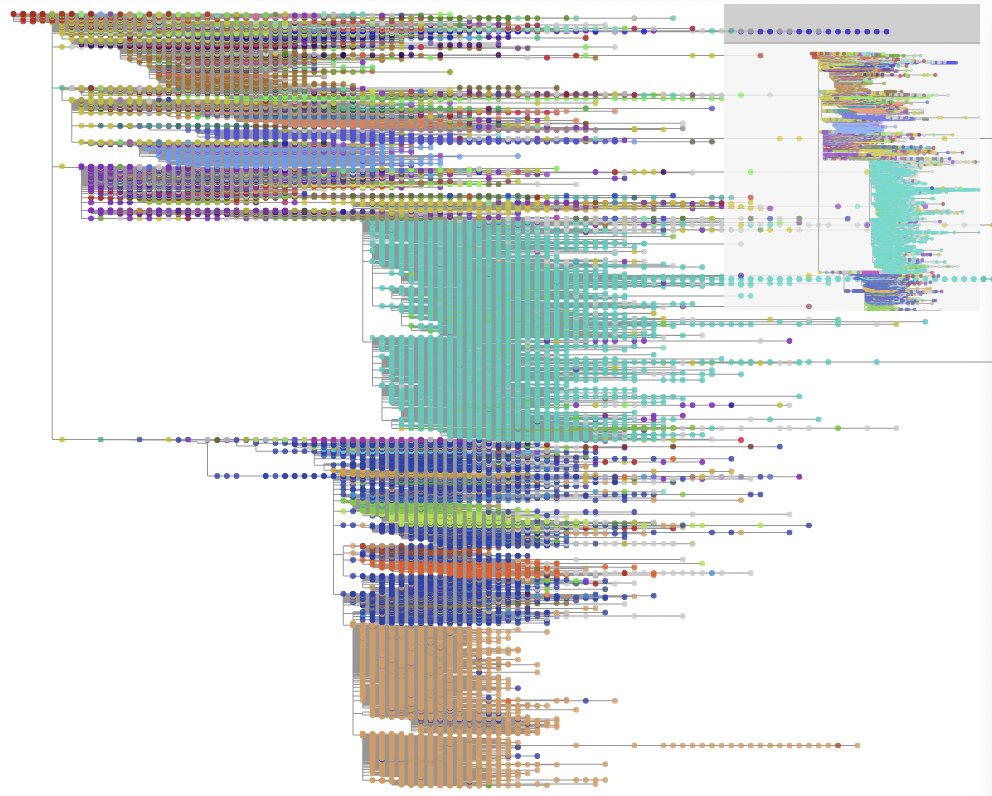
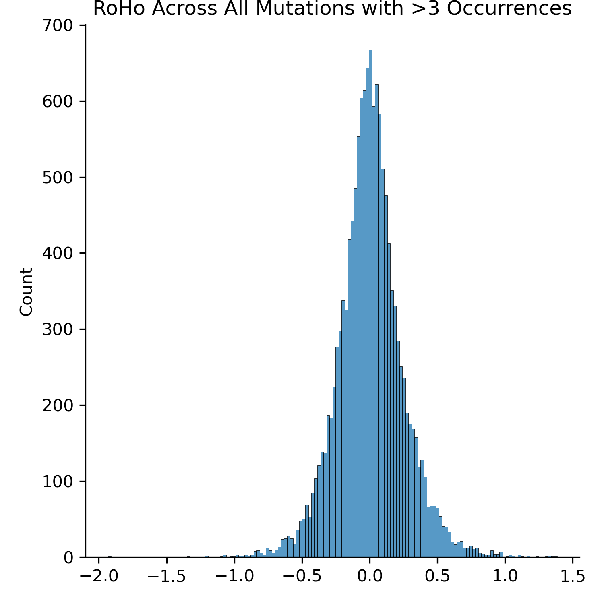
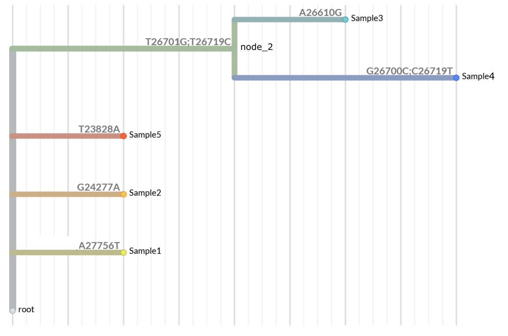
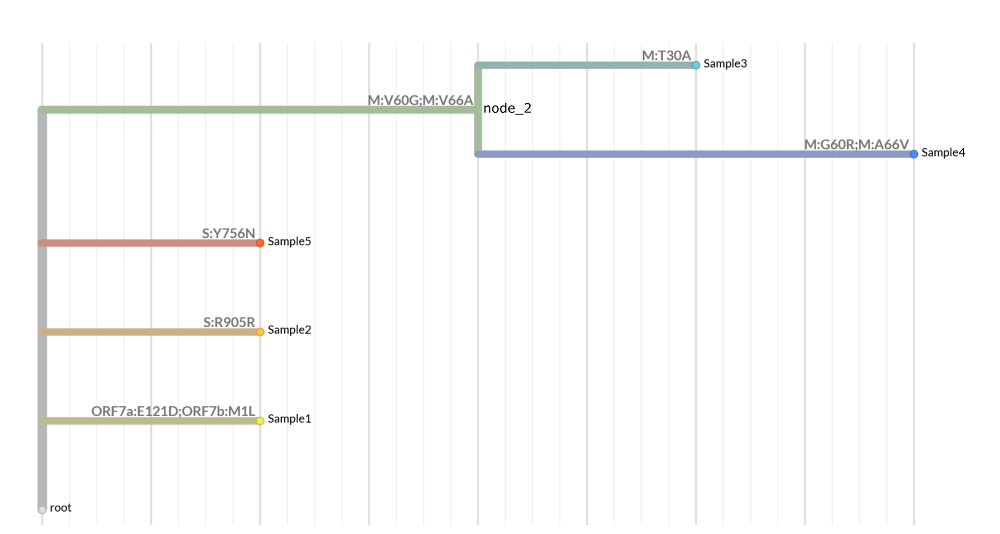

.. include:: includes.rst.txt

*********************************************
Tutorials
*********************************************

This document contains example workflows for UShER, matUtils, and RIPPLES.

.. _ripples-tutorial:

Using RIPPLES to detect recombination in new sequences
-----------------------------------------------------------

Users interested in recombination may want to use RIPPLES to search for recombination events in their set of samples. In this example, we will search for recombination events involving a set of samples based on `this preprint <https://www.medrxiv.org/content/10.1101/2021.06.18.21258689v1>`_ by Jackson et al..

First, download the latest public tree, a set of sample sequences to search for recombination, the reference genome, and sites to mask:

.. code-block:: sh

    wget http://hgdownload.soe.ucsc.edu/goldenPath/wuhCor1/UShER_SARS-CoV-2/public-latest.all.masked.pb.gz
    wget https://raw.githubusercontent.com/bpt26/usher_wiki/main/docs/source/test_samples.fa
    wget https://hgdownload.soe.ucsc.edu/goldenPath/wuhCor1/bigZips/wuhCor1.fa.gz
    wget https://raw.githubusercontent.com/W-L/ProblematicSites_SARS-CoV2/master/problematic_sites_sarsCov2.vcf

.. note:: 
    Your exact results may be slightly different than what is shown here, as the public tree is updated daily. To get the same tree used in this tutorial, use the following command:

.. code-block:: sh

  wget http://hgdownload.soe.ucsc.edu/goldenPath/wuhCor1/UShER_SARS-CoV-2/2021/08/04/public-2021-08-04.all.masked.pb

Then, mask problematic sites using the downloaded .vcf:

.. code-block:: sh
    
    gunzip wuhCor1.fa.gz
    mafft --thread 10 --auto --keeplength --addfragments test_samples.fa wuhCor1.fa > aligned_seqs.fa
    faToVcf -maskSites=problematic_sites_sarsCov2.vcf aligned_seqs.fa aligned_seqs.vcf

Then, use UShER to add your samples to the protobuf:

.. code-block:: sh
    
    usher -T 10 -i public-latest.all.masked.pb.gz -v aligned_seqs.vcf -o user_seqs.pb

Then, use RIPPLES to search for recobination events involving these samples in the tree:

.. code-block:: sh

    mkdir USER_SAMPLES/
    grep -e '>' test_samples.fa | perl -pi -e 's/>//' > user_samples.txt
    ripples -i user_seqs.pb -s user_samples.txt -d USER_SAMPLES/ -T 10

After a few minutes, RIPPLES produces files `recombination.tsv` and `descendants.tsv`. The last two columns in the `recombination.tsv` file represent the parsimony score improvement. Suppose that we are interested specifically in recombinant nodes with highest parsimony score improvement, as these are more likely to reflect true recombination events. This command yields all recombination events with parsimony improvements greater than 7:

.. code-block:: sh

    awk '$11 - $12 > 7' USER_SAMPLES/recombination.tsv

The results should look something like this:

.. code-block:: sh

    node_49072  (0,241) (10870,11288) node_111282 n 41  node_49068  n 12  12  12  4
    node_49072  (0,241) (14408,14676) node_179776 n 36  node_49068  n 12  12  12  4
    node_49072  (0,241) (7728,10870)  node_179776 n 36  node_49068  n 12  12  12  3
    node_49072  (0,241) (6954,7728) node_146650 n 40  node_49068  n 12  12  12  4
    node_49072  (241,913) (7728,10870)  node_179776 n 36  node_49068  n 12  12  12  4
    node_49072  (7728,10870)  (29218,GENOME_SIZE) node_49068  n 12  node_179776 n 36  12  12  4
    node_92879  (0,445) (21255,22227) node_48600  n 28  node_151816 n 20  10  10  1
    node_92879  (0,445) (20410,22227) node_48600  n 28  node_151816 n 20  10  10  2
    node_92900  (0,241) (23403,23604) node_253479 n 26  node_136388 n 25  13  13  5
    node_92900  (0,241) (23271,23604) node_253479 n 26  node_136388 n 25  13  13  5
    node_92900  (0,241) (23063,23271) node_253479 n 26  node_136388 n 25  13  13  4
    node_92900  (0,241) (22444,23063) node_253479 n 26  node_98962  n 23  13  13  3
    node_92900  (0,241) (21123,23063) node_253479 n 26  node_98962  n 23  13  13  4
    node_92900  (0,241) (18877,21123) node_253479 n 26  node_108815 n 25  13  13  4
    node_92900  (241,1947)  (21123,23271) node_253479 n 26  node_119821 n 22  13  13  5
    node_92900  (241,1947)  (22444,23063) node_253479 n 26  node_119821 n 22  13  13  4
    node_92900  (241,1947)  (18877,21123) node_253479 n 26  node_108815 n 25  13  13  5
    node_92900  (1947,2319) (22444,23063) node_253479 n 26  node_119821 n 22  13  13  5
    node_92900  (18131,21123) (28977,29742) node_108815 n 25  node_253479 n 26  13  13  5
    node_92900  (21779,22444) (28977,29742) node_98068  n 27  node_253479 n 26  13  13  5
    node_92900  (22444,23063) (28977,29742) node_100243 n 23  node_253479 n 26  13  13  5

We can then parse the `descendants.tsv` file to look at the descendants for each of these nodes:

.. code-block:: sh

    awk '$1 == "node_49072"' USER_SAMPLES/descendants.tsv
    awk '$1 == "node_92879"' USER_SAMPLES/descendants.tsv
    awk '$1 == "node_92900"' USER_SAMPLES/descendants.tsv

These commands yield the descendants for the nodes of interest. We find that node_49072 is an ancestor of the sample s1. node_92879 is an ancestor of the samples s4, s5, and s6. node_92900 is an ancestor of samples s8, s9, and s10. 

-----------------------------------------------------------
Snakemake Workflow
-----------------------------------------------------------

Alternatively, after `installing snakemake <https://snakemake.readthedocs.io/en/stable/getting_started/installation.html>`_, the following set of commands may be used to search for evidence of recombination in a user-input set of sequences:

.. code-block:: sh

    cd usher/workflows
    snakemake --use-conda --cores 4 --config FASTA="/path/to/fasta" RUNTYPE="ripples"
    

.. _taxodium-tutorial:

Using Taxonium to visualize phylogenies
-------------------------------------------------

We recommend using `Taxonium <https://taxonium.org/>`_ to visualize these trees. An example of a phylogeny visualized by this software is shown below:

You can use `Taxoniumtools <https://docs.taxonium.org/en/latest/taxoniumtools.html>`_ to convert from UShER to Taxonium format.

.. code-block:: sh

    conda install -c conda-forge python
    pip install taxoniumtools
    wget http://hgdownload.soe.ucsc.edu/goldenPath/wuhCor1/UShER_SARS-CoV-2/public-latest.metadata.tsv.gz && gunzip public-latest.metadata.tsv.gz
    wget http://hgdownload.soe.ucsc.edu/goldenPath/wuhCor1/UShER_SARS-CoV-2/public-latest.all.masked.pb.gz
    wget https://raw.githubusercontent.com/theosanderson/taxonium/master/taxoniumtools/test_data/hu1.gb
    usher_to_taxonium --input public-latest.all.masked.pb.gz --output public-latest-taxonium.jsonl.gz --metadata public-latest.metadata.tsv --genbank hu1.gb --columns genbank_accession,country,date,pangolin_lineage
    
You then open that `.jsonl.gz` file on `Taxonium <https://taxonium.org/>`_  directly, or with the `Taxonium desktop app <https://docs.taxonium.org/en/latest/app.html>`_ which may handle large trees better

-----------------------------------------------------------
Snakemake Workflow
-----------------------------------------------------------

For simplicity, we include the above set of commands as a `snakemake <https://snakemake.readthedocs.io/en/stable/getting_started/installation.html>`_ workflow. Here, the user-specified input is a set of sequences to be added to the latest public tree. This workflow can be run using the following commands:

.. code-block:: sh

    cd usher/workflows
    snakemake --use-conda --cores 4 --config FASTA=”path/to/fa/file” RUNTYPE=”taxodium”

.. _basic-matUtils-workflow:

Basic matUtils Workflow
-------------------------------

Though it is bundled and installed alongside UShER, matUtils is more than an output processor for UShER commands. 
It can be used in independent workflows that begin with one of our `publicly-provided MAT protobuf files <http://hgdownload.soe.ucsc.edu/goldenPath/wuhCor1/UShER_SARS-CoV-2/>`_, 
or an Augur-formatted MAT JSON file as used by Nextstrain. matUtils can be used to explore large trees in deep detail, parsing and manipulating trees of a size
few other tools can manage efficiently.
The first step to using one of these public files is `matUtils summary`, which can calculate basic statistics or summarize sample, clade, or mutation-level frequency information.

.. code-block:: sh

  matUtils summary -i public-2021-05-17.all.masked.nextclade.pangolin.pb.gz 

This particular tree has 757500 unique samples represented in it. We can further explore this dataset with another `matUtils summary` command:

.. code-block:: sh

  matUtils summary -i public-2021-05-17.all.masked.nextclade.pangolin.pb.gz -A -d summary_out

Let's say we're interested in recurrent, or homoplasic, mutations across this tree. The mutations summary file contains the number of independent occurrences of a 
mutation across the tree. 

.. code-block:: sh

  awk '$2 >= 500' summary_out/mutations.tsv

C>T mutations are very overrepresented in this set, being a common mutation and error type. We're concerned about correctly identifying real homoplasic mutations,
instead of coincident or erroneous mutations, so we filter the dataset down to higher-quality placements and samples.

.. code-block:: sh

  matUtils extract -i public-2021-05-17.all.masked.nextclade.pangolin.pb.gz -a 3 -b 5 -o filtered.pb
  matUtils summary -i filtered.pb

After filtering, our tree contains 701375 samples, which is 92% of the original tree size. Let's see how our homoplasic mutation output looks.

.. code-block:: sh

  matUtils summary -i filtered.pb -m filtered_mutations.tsv
  awk '$2 > 500' filtered_mutations.tsv

By filtering 8% of our tree, we have removed most of the mutations with more than five hundred unique occurrences. The C>T bias is still present, 
but we can more comfortably proceed to analyze these mutations. The most homoplasic mutation, a significant outlier with more than a thousand occurrences
after filtering, is G7328T. This is a mutation in ORF1A, part of the replicase protein which the virus uses to duplicate itself in the host, which causes
an amino acid change from alanine to serine at position 2355.

If we were interested in following up on this potential homoplasy, we have a few options. We may want to generate a new protobuf file containing only 
samples with this specific mutation, along with a JSON for visualization and additional sample path information. We can perform all these operations with
a single command.

.. code-block:: sh

  matUtils extract -i filtered.pb -m G7328T -o G7328T.pb -j G7328T.json -S G7328T_sample_paths.txt 

`The expected output can be viewed here <https://nextstrain.org/fetch/raw.githubusercontent.com/bpt26/usher_wiki/main/docs/source/G7328T.json>`_
or you can upload your generated JSON at `Auspice <https://auspice.us/>`_.

In this view, we can choose to highlight each branch and node by whether they contained our query mutation.
We can see that the majority of occurrences of G7328T are single nodes- having just occurred- and that the majority are from the USA, though from all across the phylogenetic tree.
Further analysis would be required to validate or interpet these results, but this procedure clearly demonstrates the potential for matUtils for 
rapid exploratory analysis using large public datasets.

-----------------------------------------------------------
Snakemake Workflow
-----------------------------------------------------------

We also provide a `snakemake <https://snakemake.readthedocs.io/en/stable/getting_started/installation.html>`_ workflow to add user-input sequences in .fasta format to the latest public tree, and extract subtrees of size 500 for each. These subtrees are output in .json format for simple drag-and-drop visualization with `Auspice <https://auspice.us/>`_. This workflow can be run using the following commands:

.. code-block:: sh

    cd usher/workflows
    snakemake --use-conda --cores 4 --config FASTA=”path/to/fa/file” RUNTYPE=”matUtils”

.. _uncertainty-tutorial:

Example Uncertainty Workflow
-------------------------------

In this example we will calculate uncertainty metrics for samples belonging to clade B.1.500 and visualize them on `auspice <https://auspice.us/>`_.

Download the example protobuf file `public-2021-05-17.all.masked.nextclade.pangolin.pb.gz <https://hgwdev.gi.ucsc.edu/~angie/UShER_SARS-CoV-2/2021/05/17/public-2021-05-17.all.masked.nextclade.pangolin.pb.gz>`_ (protobuf file containing the mutation annotated tree with clade annotations)

The first step is generating a visualizable JSON of the clade of interest, along with getting the names of samples involved.
This is done with matUtils extract. In our example, we will get the samples associated with a small pangolin clade.

.. code-block:: sh

    matUtils extract -i public-2021-05-17.all.masked.nextclade.pangolin.pb.gz -c B.1.500 -u b1500_samples.txt -j b1500_viz.json

The second step is to call matUtils uncertainty. The input PB is the original PB, with the sample selection text file, instead of a subtree pb generated with -o.
This is because its going to search for placements all along the original tree; if a subtree .pb was passed, it would only search for placements within that subtree.

.. code-block:: sh

    matUtils uncertainty -i public-2021-05-17.all.masked.nextclade.pangolin.pb.gz -s b1500_samples.txt -e b1500_uncertainty.tsv -o b1500_placements.tsv

These can now be uploaded for visualization by drag and drop onto the `auspice <https://auspice.us/>`_ website. Drag and drop the b1500_viz.json first, then the tsv files second.
Alternatively, one of the metadata files can be included in JSON generation by matUtils extract.

.. code-block:: sh

    matUtils extract -i public-2021-05-17.all.masked.nextclade.pangolin.pb.gz -s b1500_placements.txt -z 100 -M b1500_placements.tsv -j b1500_annotated.json

The placement metadata file in this example is also passed into -s as well as -M to ensure that all samples with placement information are included in the output. 
-z fills out additional random samples to contextualize the data. b1500_uncertainty.tsv can be drag-and-dropped onto the Auspice view to display additional colorings.

`The expected output can be viewed in full here. <https://nextstrain.org/fetch/raw.githubusercontent.com/bpt26/usher_wiki/main/docs/source/b1500_annotated.json>`_

.. _introduce-tutorial:

Example Introduce Workflow
-------------------------------

.. note:: 
    This feature is currently under active development! We are actively soliciting feedback on the usefulness of the current implementation, additional features
    that would be valuable, or directions to take this type of analysis. Please reach out on the GitHub or directly to me via my email, 
    jmcbroom@ucsc.edu.

In this example we will infer and investigate introductions of SARS-CoV-2 into Spain using public information
on the command line and visualize an example introduction of interest with Auspice.

Before beginning, download the example protobuf file `public-2021-04-20.all.masked.nextclade.pangolin.pb <https://hgwdev.gi.ucsc.edu/~angie/UShER_SARS-CoV-2/2021/03/02/public-2021-03-02.all.masked.nextclade.pangolin.pb>`_ 

We need a region to analyze; in this example, we are going to use Spain, as it has a few hundred associated samples in the public data
and is a solid representative example. We need to generate the two-column tab-separated file we use as input to `matUtils introduce`.

.. code-block:: sh

    matUtils summary -i public-2021-04-20.all.masked.nextclade.pangolin.pb -s 420_sample_parsimony.txt
    grep “Spain” 420_sample_parsimony.txt | awk ‘{print $1”\tSpain”}’ > spanish_samples.txt

We can now apply `matUtils introduce` using this file as input.

.. code-block:: sh

    matUtils introduce -i public-2021-04-20.all.masked.nextclade.pangolin.pb -s spanish_samples.txt -o spanish_introductions.txt

The output table (spanish_introductions.txt) has columns for the sample, the identifier of the introduction node, the confidence of that introduction point being in region,
the confidence of the parent of that introduction point being in region, the number of mutations between the sample and this introduction point,
any clades associated with the introduction point, and the path of mutations to the point of introduction.

Generally the confidence of the introduction point will be greater than 0.5 and the confidence of the parent of the introduction point will be less than 0.5,
marking the point on the history where we stop being confident that the represented ancestral sequence was local to the region. 

We can count the number of unique introductions into our region of interest- in this case Spain- using awk.

.. code-block:: sh

    awk '{print $2}' spanish_introductions.tsv | sort | uniq -c | sort -r | head -25 

We find 216 unique introductions into Spain, of which 175 are associated with only a single sample, from 295 total samples.
This may suggest that Spain has a lot of movement in and out of the country, or that sampling is biased towards travelers. 
It may also simply reflect that Spain is undersampled and the relative number of introductions is high enough that most
new regional clades are sampled only once or not at all. 

There are some interesting cases of clades from a single introduction, however. The clade introduced at the internal node "96055" 
contains 9 closely related samples from Spain and are all members of the variant of concern B.1.1.7.

.. code-block:: sh

    awk '$2 == "96055"' spanish_introductions.tsv

.. warning::
    Internal node names are not maintained in the protobuf and are not guaranteed to be consistent between protobufs with differing content.
    The path of mutations to the point of introduction will generally be consistent, however.

The first entry of this output is reproduced here, sans the mutation path.

.. code-block:: sh

    ESP/hCoV-19_Spain_CT-HUVH-32938_2021/2021|MW769763.1|21-01-14	96055	2	4.5	2021-Jan-14	2021-Jan-21	9	51		1	0.0431655	3

We can see that this introduction point is very confidently in Spain (confidence of 1 in column 9, as every descendent is from Spain) but that 
the parent of that introduction point is very confidently NOT from Spain (confidence of 0.043 to be in Spain). This makes this a strongly supported introduction
of a variant of concern into our region. Samples in this cluster span the week from the 14th to the 21st of January 2021, meaning that it has a cluster
growth score of 9/(1+1) or 4.5, which puts it second on our ranked cluster list. Let's take a closer look by visualizing it on the `Auspice <https://auspice.us/>`_ web interface.

To do this, first we will need to generate an auspice-compatible JSON containing our introduction set and some context samples. We can do this 
by selecting one of our samples and extracting the context to a JSON with `matUtils extract`.

.. code-block:: sh

    matUtils extract -i public-2021-04-20.all.masked.nextclade.pangolin.pb -k "ESP/hCoV-19_Spain_CT-HUVH-76622_2021/2021|MW769758.1|21-01-19:50" -j spanish_introduction.json

This JSON can be drag-and-dropped onto the Auspice web interface. `You can view the expected output interactively here. <https://nextstrain.org/fetch/raw.githubusercontent.com/bpt26/usher_wiki/main/docs/source/spanish_introduction.json>`_

.. image:: colored_spanish_introduction.png
    :width: 1500px
    :align: center

Samples from England appear in blue, Spain in green, and Wales in yellow in this image. We can see that our group of 9 B.1.1.7 samples forms a clear clade that was likely introduced into Spain from England.

Additional steps we could include are the generation of metadata tsv/csv for Auspice, the inclusion of more regions, and the inclusion of phylogeographic statistics with
-a on our call to `matUtils introduce`. The latter increases the runtime of the introduce command from a few seconds to about two minutes in this case.

Spain has an overall association index of 10.4 under a 95% confidence interval of (28.95,40.19) for the null that 
samples from this region are not phylogenetically associated.
This is a very, very significant association score, which is normal for geographic regions, as naturally samples from the same region
are more closely related to one another. The largest monophyletic clade size is 9, representing our specific introduction of interest.

Our specific introduction of interest itself also has a monophyletic clade size of 9 (being pure with 9 samples) and an association index of 0,
representing that it is purely in-region and is maximally associated. 

Including additional public region information in the input two-column tsv would also allow us to explore potential origins of each introduction,
such as how England appears to be the origin in our example, or estimate relative levels of migration to and from Spain to other countries across the world.
Origin and migration must be interpreted cautiously, however, due to extensive sampling bias by country (England and the UK contribute a large part
of publicly available sequence information, and are therefore more likely to be identified as the origin of an introduction, et cetera).

-----------------------------------------------------------
Snakemake Workflow
-----------------------------------------------------------

We also provide a `snakemake <https://snakemake.readthedocs.io/en/stable/getting_started/installation.html>`_ workflow to search for unique introductions within a user-input set of samples. This workflow can be run using the following commands:

.. code-block:: sh

    cd usher/workflows
    snakemake --use-conda --cores 4 --config FASTA="/path/to/fasta" RUNTYPE="introduce"
    

.. _roho-tutorial: 

Calculating by-mutation RoHo with `matUtils summary` and Python
------------------------------------------------------------------

The Ratio of Homoplasic Offspring (RoHo) is the log10 of the ratio of the descendents of a clade with a specific mutation to a sister clade without a mutation. 
It is negative when the clade with the mutation is smaller than its sister, and positive when it is larger. 

As originally formulated, this metric assumes a bifurcating, fully resolved tree. As the MAT is not a resolved tree and contains many 
internal polytomies, we use the median size of all sister clades for calculation. The number of sister clades for each occurrence is included in the output table. 
The output table of summary is by-occurrence, so distributions of values associated with a specific homoplasic mutation can be selected by finding all rows with that mutation in the first column. 

Before beginning, download the example protobuf file `public-2021-06-09.all.masked.nextclade.pangolin.pb.gz <http://hgdownload.soe.ucsc.edu/goldenPath/wuhCor1/UShER_SARS-CoV-2//2021/06/09/public-2021-06-09.all.masked.nextclade.pangolin.pb.gz>`_ 

.. code-block:: sh

    matUtils summary -i public-2021-06-09.all.masked.nextclade.pangolin.pb.gz -R roho_scores.tsv

The resulting table contains the following columns:

.. code-block:: sh

    mutation	parent_node	child_count	occurrence_node	offspring_with	median_offspring_without	single_roho

Mutation is the encoding string for a given nucleotide mutation (ReferenceLocationAlternative, e.g. A235G). The parent_node is the identifier 
of the parent of the node on which this mutation occurred and the occurrence_node is the identifier of that node proper; these numbers are used 
for downstream QC and analysis with matUtils extract. Child_count is the number of sister clades associated with the parent of 
the clade of interest. Offspring_with is simply the number of descendents from the clade with this mutation.
Median_offspring_without is the median value of the number of descendents of each sister clade to this clade (they all share the same parent_node). 
Single_roho is the log10 of offspring_with divided by median_offspring_without.

Using the standard data analysis Python packages Pandas and Seaborn, we can calculate and visualize the genome-wide distribution of RoHo 
values, specifically the mean RoHo value belonging to each homoplasic mutation with >3 occurrences.

.. code-block:: python

    import pandas as pd
    import seaborn as sns
    import numpy as np
    rdf = pd.read_csv('roho_scores.tsv',sep='\t')
    by_mut_rohos = []
    for m, sdf in rdf.groupby("mutation"):
        if sdf.shape[0] >= 3:
            by_mut_rohos.append(np.mean(sdf.single_roho))
    print(np.mean(by_mut_rohos))
    sns.displot(by_mut_rohos)

The mean RoHo of this distribution is 0.005, suggesting very little bias, though the negative tail is longer than the positive tail. 
The resulting plot is replicated below. 

    
.. _translate-tutorial:

Example Amino Acid Translation Workflow
---------------------------------------

As mutations from the reference accumulate in sequenced SARS-CoV-2 samples, there may be multiple nucleotide mutations in a single codon. In this case, protein sequences computed using nucleotide mutations at leaves may be incorrect if another mutation in the same codon occured higher up the tree. ``matUtils summary --translate`` provides a way to compute the correct amino acid translations at each node.

In this workflow, we will output amino acid mutations at each node of a protobuf, and prepare an annotated JSON suitable for visualization with Auspice.

**Prepare data**

Download the example protobuf file (:download:`translate_example.pb <./translate_example.pb>`), GTF file (:download:`ncbiGenes.gtf <./ncbiGenes.gtf>`), and reference FASTA (`NC_045512v2.fa <https://raw.githubusercontent.com/yatisht/usher/5e83b71829dbe54a37af845fd23d473a8f67b839/test/NC_045512v2.fa>`_).

.. note:: 
    The input GTF must follow the conventions specified `here <https://mblab.wustl.edu/GTF22.html>`__.
    If multiple ``CDS`` features are associated with a single ``gene_id``,
    they must be ordered by start position.

The example protobuf file is a simple tree with the following structure:

**Run matUtils summary to get amino acid translations**

To call amino acid mutations in the mutation-annotated tree, run the following commmand:

.. code-block:: sh

    matUtils summary --translate coding_mutations.tsv -i translate_example.pb -g ncbiGenes.gtf -f NC_045512v2.fa
    
This will produce a TSV file named ``coding_mutations.tsv``. The contents of the file are shown below

.. code-block::

    (line 1): node_id     aa_mutations            nt_mutations        leaves_sharing_mutations
    (line 2): Sample1     ORF7a:E121D;ORF7b:M1L   A27756T;A27756T     1
    (line 3): Sample2     S:R905R                 G24277A             1
    (line 4): Sample5     S:Y756N                 T23828A             1
    (line 5): node_2      M:V60G;M:V66A           T26701G;T26719C     2
    (line 6): Sample4     M:G60R;M:A66V           G26700C;C26719T     1
    (line 7): Sample3     M:T30A                  A26610G             1
    

**TSV Output format**

Each line in the file corresponds to a node in the tree. Only nodes with mutations (including synonymous) are included.

``aa_mutations`` are always delimited by a ``;`` character, and can be matched with their corresponding nucleotide mutations in the ``nt_mutations`` column (also delimited by ``;``).
 
 
If there are mulitple nucleotide mutations in one node affecting a single codon (rare), they will be separated by commas in the ``nt_mutations`` column.

In the case that a single nucleotide mutation affects multiple codons,
the affected codons are listed sequentially, and the nucleotide mutation is repeated in the ``nt_mutation`` column. An example of this
case is shown in line 2 of the file above: 

.. code-block:: javascript

    Sample1     ORF7a:E121D;ORF7b:M1L   A27756T;A27756T     1

``A27756T`` mutates both the last codon of Orf7a and the start codon of Orf7b.

``leaves_sharing_mutations`` indicates the number of descendant leaves of the node that share its set of mutations (including itself, if the node is a leaf).

**Synonymous mutations**

Synonymous mutations are included in the output. See the example in line 3 of ``coding_mutations.tsv``:

.. code-block:: javascript

    Sample2     S:R905R                 G24277A             1

**Mutation accumulation / Back-mutations**

The following two lines demonstrate how ``matUtils summary --translate`` considers mutations higher in the tree when
computing protein changes.

.. code-block:: javascript

    node_2      M:V60G;M:V66A           T26701G;T26719C     2
    Sample4     M:G60R;M:A66V           G26700C;C26719T     1
    
``Sample4`` is a child of the internal node ``node_2``. The mutation ``G26700C`` in ``Sample4`` is in the same codon (M:60)
as ``T26701G``. The protein follows the path ``V (root) -> G (node_2) -> R (Sample4)``.

The above two lines also show an example of a back-mutation. The nucleotide mutation ``T26719C`` yields ``M:V66A`` in ``node_2``, which
is then back-mutated to V by ``C26719T`` in ``Sample4``.

**Run matUtils extract to annotate a JSON tree for visualization**

To produce a JSON file with the metadata we produced above, run the following command:

.. code-block:: javascript

    matUtils extract -i translate_example.pb -M coding_mutations.tsv -j aa_annotated.json

The resulting JSON file can now be loaded into Nextstrain / Auspice. Here is the tree with amino acid annotations:

View the expected JSON in Nextstrain `here <https://nextstrain.org/fetch/raw.githubusercontent.com/bpt26/usher_wiki/main/docs/source/aa_annotated.json?branchLabel=aa_mutations&c=aa_mutations>`__.

You can use the ``Branch Labels`` menu in the sidebar to view the annotations.

-----------------------------------------------------------
Snakemake Workflow
-----------------------------------------------------------

We also include a `snakemake <https://snakemake.readthedocs.io/en/stable/getting_started/installation.html>`_ workflow to translate mutations in a user-input .fasta file to amino acid substitutions in a lineage-aware manner. This workflow can be run using the following commands:

.. code-block:: sh

    cd usher/workflows
    snakemake --use-conda --cores 4 --config FASTA="/path/to/fa" RUNTYPE="translate"

.. _protobuf-tutorial:

Interacting Directly with Protobuf Files in Python [ADVANCED USERS]
--------------------------------------------------------------------

Advanced users may desire to interface directly with the protobuf. The following is a brief tutorial on doing so.
Google's general tutorial on interacting with protobuf in python can be found `here <https://developers.google.com/protocol-buffers/docs/pythontutorial#compiling-your-protocol-buffers>`__.
The instructions here can be applied to a number of additional languages supported by google as well, such as java, PHP, and ruby.

Note that this tutorial is specifically for directly manipulating the MAT protobuf file itself in Python; 
loading a MAT data structure into memory in Python and manipulating that structure is the province of the Cython extension BTE.

The first step is to call the protoc compiler to retrieve a MAT protobuf parser. Navigate to your Usher installation (or clone the github if you installed via conda) and call:

.. code-block:: sh

    protoc -I=./ --python_out=./ ./parsimony.proto

This will generate the python file "parsimony_pb2.py". 

You can import this file into your favorite python IDE and use it to access the MAT like so:

.. code-block:: python

    import parsimony_pb2
    pb_file = open('input.pb', 'rb')
    my_mat = parsimony_pb2.data()
    my_mat.ParseFromString(pb_file.read())
    pb_file.close()

The my_mat object now contains the protobuf information, with general protobuf class attributes and four MAT specific attributes.
These are newick, condensed_nodes, metadata, and node_mutations. 

The newick attribute is simply the newick string representing the tree, as stored in the protobuf.

.. code-block:: python

    print(my_mat.newick.count(":"))
    print(my_mat.newick[:100])

The metadata attribute is a list of metadata message objects, which each have a single attribute which is a list of strings.
These strings are the clade annotations for any given node. The mutation list is similar, being a list of lists. Each list contains a 
series of mutation messages, which have attributes describing their position and identity. Each list corresponds to a single node on the tree.

.. code-block:: python

    print(len(my_mat.metadata))
    print(len(my_mat.node_mutations))

Individual node mutations are encoded as integers instead of characters for efficiency. These are in ACGT order- that is, 0 is A, 1 is C, 2 is G, and 3 is T. 
Additionally, the mut_nuc (new mutation) is another list-like attribute.

.. code-block:: python

    convert = {i:s for i,s in enumerate("ACGT")}
    for t in my_mat.node_mutations:
        if len(t.mutation) > 0:
            first_mut = t.mutation[0]
            print("First mutation encountered identifier string is: {}".format(
                convert[first_mut.ref_nuc] +
                str(first_mut.position) +
                convert[first_mut.mut_nuc[0]]))
            break

Condensed nodes is a special format container that essentially acts as a list of objects. Each object has a node_name attribute 
which is the string naming that node and another container which is essentially a list of strings of sample names.

.. code-block:: python

    print(my_mat.condensed_nodes[0].node_name)
    print(len(my_mat.condensed_nodes[0].condensed_leaves))

These are the essentials for writing a custom analysis directly interacting with the protobuf. For most user's purposes, however,
matUtils should provide the tools necessary for interacting with a MAT .pb file.
